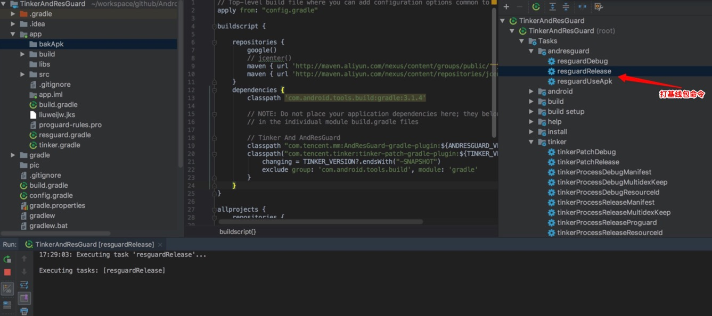
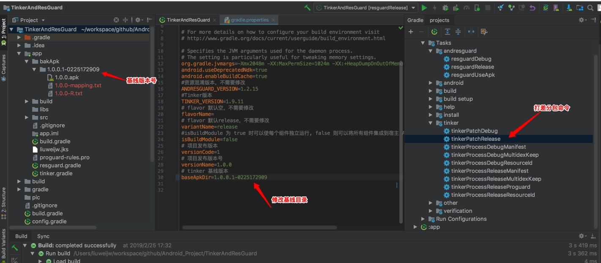
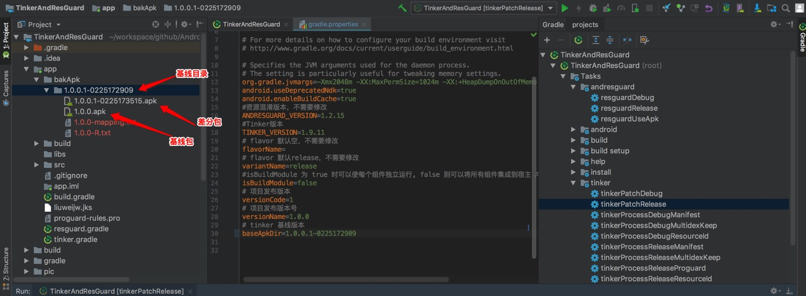

# TinkerAndResGuard
采用 Tinker 热更新（包含资源混淆AndResGuard）, 方便快速一键集成和接入。注：服务端、权限 请自行接入

# 本文接入配置

1、配置版本 [gradle.properties](gradle.properties)

2、配置 [build.gradle](build.gradle)
~~~
// Tinker And AndResGuard
classpath "com.tencent.mm:AndResGuard-gradle-plugin:${ANDRESGUARD_VERSION}"
classpath("com.tencent.tinker:tinker-patch-gradle-plugin:${TINKER_VERSION}") {
            changing = TINKER_VERSION?.endsWith("-SNAPSHOT")
            exclude group: 'com.android.tools.build', module: 'gradle'
        }
~~~

3、[resguard.gradle](app/resguard.gradle)

4、[tinker.gradle](app/tinker.gradle)

5、打包
~~~
打基线包命令：./gradlew resguardRelease
修改基线目录：app/bakApk/....
打差分包命令：./gradlew tinkerPatchRelease
~~~

6、测试

测试采用官方例子，本地测试需要修改 TinkerActivity （注：patch_signed_7zip.apk 为差分包名称），将差分包放到手机根目录即可。
~~~
 TinkerInstaller.onReceiveUpgradePatch(getApplicationContext(), Environment.getExternalStorageDirectory().getAbsolutePath() + "/patch_signed_7zip.apk");
~~~

# 官方文档介绍
[AndResGuard](https://github.com/shwenzhang/AndResGuard/edit/master/README.zh-cn.md) 是一个帮助你缩小APK大小的工具，他的原理类似Java Proguard，但是只针对资源。他会将原本冗长的资源路径变短，例如将`res/drawable/wechat`变为`r/d/a`。

`AndResGuard`不涉及编译过程，只需输入一个apk(无论签名与否，debug版，release版均可，在处理过程中会直接将原签名删除)，可得到一个实现资源混淆后的apk(若在配置文件中输入签名信息，可自动重签名并对齐，得到可直接发布的apk)以及对应资源ID的mapping文件。

[Tinker 接入介绍](https://github.com/Tencent/tinker/wiki)
Tinker是微信官方的Android热补丁解决方案，它支持动态下发代码、So库以及资源，让应用能够在不需要重新安装的情况下实现更新。当然，你也可以使用Tinker来更新你的插件

# 参考官方地址
[AndResGuard](https://github.com/shwenzhang/AndResGuard.git)

[Tinker](https://github.com/Tencent/tinker.git)
